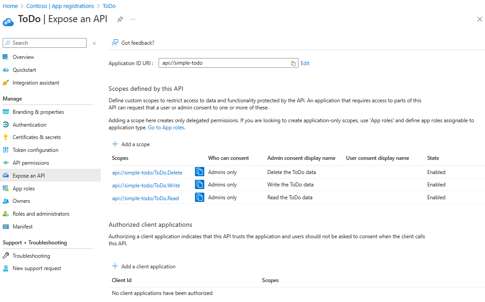
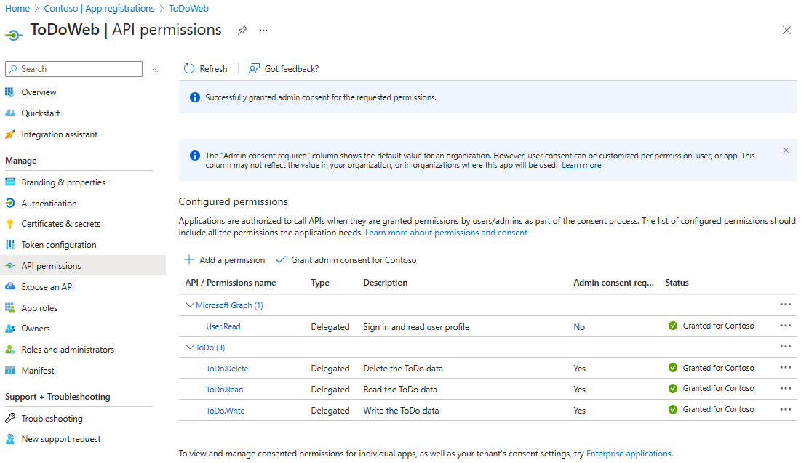

<!-- YAML front-matter schema: https://review.learn.microsoft.com/en-us/help/contribute/samples/process/onboarding?branch=main#supported-metadata-fields-for-readmemd -->
# RESTful API and PostgreSQL - Flexible Server on Azure Spring Apps

A blueprint for getting a RESTful API app with a Java API and a PostgreSQL - Flexible Server on Azure, the RESTful APIs are protected by [Azure Active Directory](https://review.learn.microsoft.com/azure/active-directory/fundamentals/active-directory-whatis) (Azure AD). The blueprint includes sample application code (a ToDo web api app) which can be removed and replaced with your own application code. Add your own source code and leverage the Infrastructure as Code assets (written in Bicep) to get up and running quickly. This architecture is for running containerized apps or microservices on a serverless platform.

This sample project is a simplified version based on the [Simple Todo](https://github.com/Azure-Samples/ASA-Samples-Web-Application) web application, which only provides the backend service and uses Azure AD to protect the RESTful APIs.

Let's jump in and get this up and running in Azure. When you are finished, you will have a RESTful API web app deployed to the cloud. In later steps, you'll see how to setup a pipeline and run the application.

### Prerequisites

The following prerequisites are required to use this application. Please ensure that you have them all installed locally.

- [Azure Developer CLI](https://aka.ms/azd-install)
- [Java 17 or later](https://learn.microsoft.com/en-us/java/openjdk/install) - for API backend
- An Azure AD instance. For instructions on creating one, see [Quickstart: Create a new tenant in Azure AD](https://learn.microsoft.com/azure/active-directory/fundamentals/create-new-tenant).
- [Docker](https://docs.docker.com/get-docker/)
- [Powershell 7](https://learn.microsoft.com/powershell/scripting/install/installing-powershell-on-windows?view=powershell-7.3) if you use windows

### Quickstart

#### Expose RESTful APIs

This section provides the steps to expose your RESTful APIs in Azure AD.

1. Sign in to the [Azure portal](https://portal.azure.com/).

1. If you have access to multiple tenants, use the **Directory + subscription** filter  to select the tenant in which you want to register an application.

1. Search for and Select **Azure Active Directory**.

1. Under **Manage**, select **App registrations** > **New registration**.

1. Enter a name for your application in the **Name** field, for example `Todo`. Users of your app might see this name, and you can change it later.

1. For **Supported account types**, select **Accounts in any organizational directory (Any Azure AD directory - Multitenant) and personal Microsoft accounts**.

1. Select **Register** to create the application.

1. On the app **Overview** page, look for the **Application (client) ID** value, and then record it for later use. You need it to configure the YAML configuration file for this project.

1. Under **Manage**, select **Expose an API**, find the **Application ID URI** at the beginning of the page, select **Add**.

1. On the **Edit application ID URI** page, accept the proposed Application ID URI (`api://{client ID}`) or use a meaningful name instead of the client ID,
   such as `api://simple-todo`, and select **Save**.

1. Under **Manage**, select **Expose an API** > **Add a scope**, and then enter the following information:

    - For **Scope name**, enter `ToDo.Read`.
    - For **Who can consent**, select **Admins only**.
    - For **Admin consent display name**, enter `Read the ToDo data`.
    - For **Admin consent description**, enter `Allows authenticated users to read the ToDo data.`.
    - For **State**, keep **Enabled**.
    - Select **Add scope**.

1. Repeat the previous step to add two other scopes: `ToDo.Write` and `ToDo.Delete`.

   

#### Update the application configuration

This section provides the steps to update the YAML file to use your Azure AD registered application information to establish a relationship with the RESTful API application.

Update the configuration of `spring.cloud.azure.active-directory` in the configuration file. Be sure to replace the placeholders with your own values you created in the previous step.

```yaml
spring:
  cloud:
    azure:
      active-directory:
        credential:
          client-id: <your-application-ID-of-ToDo>
        app-id-uri: <your-application-ID-URI-of-ToDo>
```

> [!NOTE]
> In v1.0 tokens, the configuration requires the client ID of the API, while in v2.0 tokens, you can use the client ID or the application ID URI in the request. You can configure both to properly complete the audience validation.

Use the following command to rebuild the sample project:

```bash
./mvnw clean package
```

#### Deploy to Azure Spring Apps

This quickstart will show you how to authenticate on Azure, initialize using a template, provision infrastructure and deploy code on Azure via the following commands:

```bash
# Log in to azd. Only required once per-install.
azd auth login

# Enable Azure Spring Apps feature for AZD. Only required once per-install.
azd config set alpha.springapp on

# First-time project setup. Initialize a project in the current directory, using this template. 
azd init --template Azure-Samples/ASA-Samples-Restful-Application

# Provision and deploy to Azure
azd up
```

The template uses [ASA consumption](https://learn.microsoft.com/azure/spring-apps/overview#standard-consumption-and-dedicated-plan) plan by default. If you want to switch to `Standard` plan, you can use the following command before running `azd up`.

```bash
azd env set PLAN standard
```

If you have already provisioned the resources with the consumption plan and want to try the Standard plan, you need to run `azd down` first to delete the resources, and then run the above command and `azd up` again to provision and deploy.

#### Request an access token

The RESTful APIs acts as a resource server, which is protected by Azure AD. Before acquiring an access token, it's required to register another application in Azure AD and grant permissions to the client application, which is named `ToDoWeb`.

##### Register the client application

This section provides the steps to register an application in Azure AD, which is used to add the permissions of app `ToDo`.

1. Sign in to the [Azure portal](https://portal.azure.com/).

1. If you have access to multiple tenants, use the **Directory + subscription** filter  to select the tenant in which you want to register an application.

1. Search for and Select **Azure Active Directory**.

1. Under **Manage**, select **App registrations** > **New registration**.

1. Enter a name for your application in the **Name** field, for example `ToDoWeb`. Users of your app might see this name, and you can change it later.

1. For **Supported account types**, use the default **Accounts in this organizational directory only**.

1. Select **Register** to create the application.

1. On the app **Overview** page, look for the **Application (client) ID** value, and then record it for later use. You need it to acquire access token.

1. Select **API permissions** > **Add a permission** > **My APIs**. Select the `ToDo` application that you registered earlier,
   then select the Permissions **ToDo.Read**, **ToDo.Write** and **ToDo.Delete**, and select **Add permissions**.

1. Select **Grant admin consent for {your-tenant-name}** to grant admin consent for the permissions you added.

   

1. Navigate to **Certificates & secrets** and select the **New client secret**. On the **Add a client secret** page, enter a description for the secret, select an expiration date, and select **Add**.

1. Look for the **Value** of the secret, and then record it for later use. You need it to acquire access token.

##### Add user to access the RESTful APIs

This section provides the steps to create a member user in your Azure AD, then the user can manage the data of ToDo application through RESTful APIs.

1. Under **Manage**, select **Users** > **New user** -> **Create new user**.

1. On the **Create new user** page, enter the following information:

    - **User principal name**: Enter a name for the user.
    - **Display name**: Enter a display name for the user.
    - **Password**: Copy the autogenerated password provided in the **Password** box.

   > [!NOTE]
   > 1. New users must complete the first login authentication and update their passwords, otherwise, you will receive an `AADSTS50055: The password is expired` error when you get the access token.
   > 2. When a new user logs in, they will receive an **Action Required** prompt, you may choose to **Ask later** to skip the validation.

1. Select **Review + create** to review your selections. Select **Create** to create the user.

##### Obtain the access token

This section provides the steps to use [OAuth 2.0 Resource Owner Password Credentials](https://review.learn.microsoft.com/azure/active-directory/develop/v2-oauth-ropc.md) method to obtain an access token in Azure AD, then access the RESTful APIs of the app `ToDo`.

1. Request an access token using the following command. Be sure to replace the placeholders with your own values you created in the previous step.

   ```bash
   export CLIENT_ID=<client-ID-of-your-app-ToDoWeb>
   export CLIENT_SECRET=<client-secret-of-your-app-ToDoWeb>
   export USERNAME=<user-principal-name>
   export PASSWORD='<user-password>'
   export TENANT_ID=<tenant-ID-of-your-Azure-AD>
   export SCOPE=api://simple-todo/ToDo.Read%20api://simple-todo/ToDo.Write%20api://simple-todo/ToDo.Delete
   curl -H "Content-Type: application/x-www-form-urlencoded" \
     -d "grant_type=password&client_id=${CLIENT_ID}&scope=${SCOPE}&client_secret=${CLIENT_SECRET}&username=${USERNAME}&password=${PASSWORD}" \
     "https://login.microsoftonline.com/${TENANT_ID}/oauth2/v2.0/token"
   ```

1. Look for the **access_token** value, and then record it for later use. You need it to access RESTful APIs.

#### Access the RESTful APIs

This section provides the steps to access the RESTful APIs of the app `ToDo`.

1. Define the following variables for HTTP requests:

   ```shell
   export EXPOSED_APPLICATION_URL=<your-app-exposed-application-url-or-endpoint>
   export BEARER_TOKEN=<access-token-from-previous-step>
   ```

1. Ordinary users create a ToDo list:

   ```shell
   curl -X POST ${EXPOSED_APPLICATION_URL}/api/simple-todo/lists \
    -H "Content-Type: application/json" \
    -H "Authorization: Bearer ${BEARER_TOKEN}" \
    -d "{\"name\":\"My List\"}"
   ```

   After the addition is successful, the ToDo list information will be returned.

   ```json
   {"id":"<ID-of-the-ToDo-list>","name":"My List","description":null}
   ```

1. Ordinary users create a ToDo item within a list:

   ```shell
   export LIST_ID=<ID-of-the-ToDo-list>
   curl -X POST ${EXPOSED_APPLICATION_URL}/api/simple-todo/lists/${LIST_ID}/items \
    -H "Content-Type: application/json" \
    -H "Authorization: Bearer ${BEARER_TOKEN}" \
    -d "{\"name\":\"My first ToDo item\",\"listId\":\"${LIST_ID}\",\"state\":\"todo\"}"
   ```

   After the addition is successful, the ToDo list information will be returned.

   ```json
   {"id":"<ID-of-the-ToDo-item>","listId":<ID-of-the-ToDo-list>,"name":"My first ToDo item","description":null,"state":"todo","dueDate":"2023-07-11T13:59:24.9033069+08:00","completedDate":null}
   ```

1. Anonymous users query ToDo list:

   ```shell
   curl -X GET ${EXPOSED_APPLICATION_URL}/api/simple-todo/lists
   ```

   Return ToDo list:

   ```json
   [{"id":<ID-of-the-ToDo-list>,"name":"My List","description":null}]
   ```

1. Anonymous users query Todo items within the specified list:

   ```shell
   curl -X GET ${EXPOSED_APPLICATION_URL}/api/simple-todo/lists/${LIST_ID}/items
   ```

   Return ToDo item:

   ```json
   [{"id":"<ID-of-the-ToDo-item>","listId":<ID-of-the-ToDo-list>,"name":"My first ToDo item","description":null,"state":"todo","dueDate":"2023-07-11T13:59:24.903307+08:00","completedDate":null}]
   ```

1. Ordinary users modify a ToDo item within a list:

   ```shell
   export ITEM_ID=<ID-of-the-ToDo-item>
   curl -X PUT ${EXPOSED_APPLICATION_URL}/api/simple-todo/lists/${LIST_ID}/items/${ITEM_ID} \
    -H "Content-Type: application/json" \
    -H "Authorization: Bearer ${BEARER_TOKEN}" \
    -d "{\"id\":\"${ITEM_ID}\",\"listId\":\"${LIST_ID}\",\"name\":\"My first ToDo item\",\"description\":\"Updated description.\",\"dueDate\":\"2023-07-11T13:59:24.903307+08:00\",\"state\":\"inprogress\"}"
   ```

   After the modification is successful, the latest ToDo item information will be returned.

   ```json
   {"id":"<ID-of-the-ToDo-item>","listId": <ID-of-the-ToDo-list>,"name":"My first ToDo item","description":"Updated description.","state":"inprogress","dueDate":"2023-07-11T05:59:24.903307Z","completedDate":null}
   ```

1. Admin users delete a ToDo item within a list:

   ```shell
   curl -i -X DELETE ${EXPOSED_APPLICATION_URL}/api/simple-todo/lists/${LIST_ID}/items/${ITEM_ID} \
    -H "Authorization: Bearer ${BEARER_TOKEN}"
   ```

   You should see an output like the following snippet:

   ```output
   HTTP/1.1 204
   ...
   ...
   ```

### Application Architecture

This application utilizes the following Azure resources:

- [**Azure Spring Apps**](https://docs.microsoft.com/azure/spring-apps/) to host the application
- [**Azure PostgreSQL - Flexible Server**](https://docs.microsoft.com/azure/postgresql/flexible-server/) for storage

Here's a high level architecture diagram that illustrates these components. Notice that these are all contained within a single [resource group](https://docs.microsoft.com/azure/azure-resource-manager/management/manage-resource-groups-portal), that will be created for you when you create the resources.


> This template provisions resources to an Azure subscription that you will select upon provisioning them. Please refer to the [Pricing calculator for Microsoft Azure](https://azure.microsoft.com/pricing/calculator/) and, if needed, update the included Azure resource definitions found in `infra/main.bicep` to suit your needs.

### Application Code

This template is structured to follow the [Azure Developer CLI](https://aka.ms/azure-dev/overview). You can learn more about `azd` architecture in [the official documentation](https://learn.microsoft.com/azure/developer/azure-developer-cli/make-azd-compatible?pivots=azd-create#understand-the-azd-architecture).

### Next Steps

At this point, you have a complete application deployed on Azure. But there is much more that the Azure Developer CLI can do. These next steps will introduce you to additional commands that will make creating applications on Azure much easier. Using the Azure Developer CLI, you can delete the resources easily.

- [`azd down`](https://learn.microsoft.com/azure/developer/azure-developer-cli/reference#azd-down) - to delete all the Azure resources created with this template


### Additional `azd` commands

The Azure Developer CLI includes many other commands to help with your Azure development experience. You can view these commands at the terminal by running `azd help`. You can also view the full list of commands on our [Azure Developer CLI command](https://aka.ms/azure-dev/ref) page.

## Reporting Issues and Feedback

If you have any feature requests, issues, or areas for improvement, please [file an issue](https://aka.ms/azure-dev/issues). To keep up-to-date, ask questions, or share suggestions, join our [GitHub Discussions](https://aka.ms/azure-dev/discussions). You may also contact us via AzDevTeam@microsoft.com.
