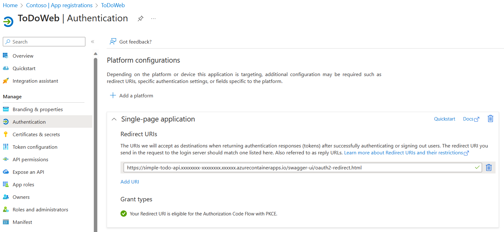
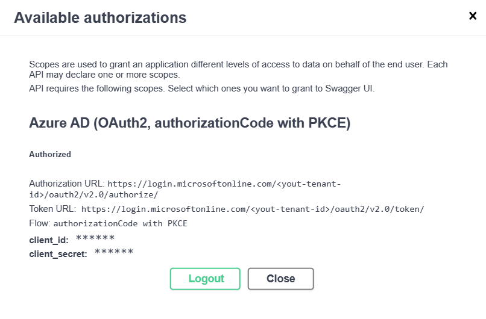

<!-- YAML front-matter schema: https://review.learn.microsoft.com/en-us/help/contribute/samples/process/onboarding?branch=main#supported-metadata-fields-for-readmemd -->
# RESTful API and PostgreSQL - Flexible Server on Azure Spring Apps

A blueprint for getting a RESTful API app with a Java API and a PostgreSQL - Flexible Server on Azure, the RESTful APIs are protected by [Microsoft Entra ID](https://learn.microsoft.com/entra/fundamentals/whatis). The blueprint includes sample application code (a ToDo web api app) which can be removed and replaced with your own application code. Add your own source code and leverage the Infrastructure as Code assets (written in Bicep) to get up and running quickly. This architecture is for running containerized apps or microservices on a serverless platform.

This sample project is a simplified version based on the [Simple Todo](https://github.com/Azure-Samples/ASA-Samples-Web-Application) web application, which only provides the backend service and uses Microsoft Entra ID to protect the RESTful APIs.

Let's jump in and get this up and running in Azure. When you are finished, you will have a RESTful API web app deployed to the cloud. In later steps, you'll see how to set up a pipeline and run the application.

### Prerequisites

The following prerequisites are required to use this application. Please ensure that you have them all installed locally.

- [Azure Developer CLI](https://aka.ms/azd-install)
- [Java 17 or later](https://learn.microsoft.com/en-us/java/openjdk/install) - for API backend
- A Microsoft Entra tenant. For instructions on creating one, see [Quickstart: Create a new tenant in Microsoft Entra ID](https://learn.microsoft.com/entra/fundamentals/create-new-tenant).
- [Docker](https://docs.docker.com/get-docker/)
- [Powershell 7](https://learn.microsoft.com/powershell/scripting/install/installing-powershell-on-windows?view=powershell-7.3) if you use windows

### Quickstart

#### Expose RESTful APIs

This section provides the steps to expose your RESTful APIs in Microsoft Entra ID.

1. Sign in to the [Azure portal](https://portal.azure.com/).

1. If you have access to multiple tenants, use the **Directory + subscription** filter  to select the tenant in which you want to register an application.

1. Search for and Select **Microsoft Entra ID**.

1. Under **Manage**, select **App registrations** > **New registration**.

1. Enter a name for your application in the **Name** field, for example `Todo`. Users of your app might see this name, and you can change it later.

1. For **Supported account types**, select **Accounts in any organizational directory (Microsoft Entra ID tenant - Multitenant) and personal Microsoft accounts**.

1. Select **Register** to create the application.

1. On the app **Overview** page, look for the **Application (client) ID** value, and then record it for later use. You need it to configure the YAML configuration file for this project.

1. Under **Manage**, select **Expose an API**, find the **Application ID URI** at the beginning of the page, select **Add**.

1. On the **Edit application ID URI** page, accept the proposed Application ID URI (`api://{client ID}`) or use a meaningful name instead of the client ID,
   such as `api://simple-todo`, and select **Save**.

1. Under **Manage**, select **Expose an API** > **Add a scope**, and then enter the following information:

    - For **Scope name**, enter `ToDo.Read`.
    - For **Who can consent**, select **Admins only**.
    - For **Admin consent display name**, enter `Read the ToDo data`.
    - For **Admin consent description**, enter `Allows authenticated users to read the ToDo data.`.
    - For **State**, keep **Enabled**.
    - Select **Add scope**.

1. Repeat the previous step to add two other scopes: `ToDo.Write` and `ToDo.Delete`.

   

#### Update the application configuration

This section provides the steps to update the YAML file to use your Microsoft Entra registered application information to establish a relationship with the RESTful API application.

Update the configuration of `spring.cloud.azure.active-directory` in the configuration file. Be sure to replace the placeholders with your own values you created in the previous step.

```yaml
spring:
  cloud:
    azure:
      active-directory:
        profile:
          tenant-id: <your-Microsoft-Entra-tenant-ID>
        credential:
          client-id: <your-application-ID-of-ToDo>
        app-id-uri: <your-application-ID-URI-of-ToDo>
```

> [!NOTE]
> In v1.0 tokens, the configuration requires the client ID of the API, while in v2.0 tokens, you can use the client ID or the application ID URI in the request. You can configure both to properly complete the audience validation.

Use the following command to rebuild the sample project:

```bash
./mvnw clean package
```

#### Deploy to Azure Spring Apps

This quickstart will show you how to authenticate on Azure, initialize using a template, provision infrastructure and deploy code on Azure via the following commands:

```bash
# Log in to azd. Only required once per-install.
azd auth login

# Enable Azure Spring Apps feature for AZD. Only required once per-install.
azd config set alpha.springapp on

# First-time project setup. Initialize a project in the current directory, using this template. 
azd init --template Azure-Samples/ASA-Samples-Restful-Application

# Provision and deploy to Azure
azd up
```

The template uses [ASA consumption](https://learn.microsoft.com/azure/spring-apps/overview#standard-consumption-and-dedicated-plan) plan by default. If you want to switch to `Standard` plan, you can use the following command before running `azd up`.

```bash
azd env set PLAN standard
```

If you have already provisioned the resources with the consumption plan and want to try the Standard plan, you need to run `azd down` first to delete the resources, and then run the above command and `azd up` again to provision and deploy.

#### Obtain the access token

The RESTful APIs acts as a resource server, which is protected by your Microsoft Entra tenant. Before acquiring an access token, it's required to register another application in your Microsoft Entra and grant permissions to the client application, which is named `ToDoWeb`.

##### Register the client application

This section provides the steps to register an application in your Microsoft Entra tenant, which is used to add the permissions of app `ToDo`.

1. Sign in to the [Azure portal](https://portal.azure.com/).

1. If you have access to multiple tenants, use the **Directory + subscription** filter  to select the tenant in which you want to register an application.

1. Search for and Select **Microsoft Entra ID**.

1. Under **Manage**, select **App registrations** > **New registration**.

1. Enter a name for your application in the **Name** field, for example `ToDoWeb`. Users of your app might see this name, and you can change it later.

1. For **Supported account types**, use the default **Accounts in this organizational directory only**.

1. Select **Register** to create the application.

1. On the app **Overview** page, look for the **Application (client) ID** value, and then record it for later use. You need it to acquire access token.

1. Select **API permissions** > **Add a permission** > **My APIs**. Select the `ToDo` application that you registered earlier,
   then select the Permissions **ToDo.Read**, **ToDo.Write** and **ToDo.Delete**, and select **Add permissions**.

1. Select **Grant admin consent for {your-tenant-name}** to grant admin consent for the permissions you added.

   

##### Add user to access the RESTful APIs

This section provides the steps to create a member user in your Microsoft Entra tenant, then the user can manage the data of ToDo application through RESTful APIs.

1. Under **Manage**, select **Users** > **New user** -> **Create new user**.

1. On the **Create new user** page, enter the following information:

    - **User principal name**: Enter a name for the user.
    - **Display name**: Enter a display name for the user.
    - **Password**: Copy the autogenerated password provided in the **Password** box.

   > [!NOTE]
   > 1. New users must complete the first login authentication and update their passwords, otherwise, you will receive an `AADSTS50055: The password is expired` error when you get the access token.
   > 2. When a new user logs in, they will receive an **Action Required** prompt, you may choose to **Ask later** to skip the validation.

1. Select **Review + create** to review your selections. Select **Create** to create the user.

##### Update the OAuth2 configuration for Swagger UI authorization

This section provides the steps to update the OAuth2 configuration for Swagger UI authorization, then you can authorize users through the app `ToDoWeb` to acquire access tokens.

1. Open the Azure Spring Apps instance in the Azure portal.

1. Open your Microsoft Entra tenant in Azure portal, go to the registered app `ToDoWeb`.

1. Under **Manage**, select **Authentication**, select **Add a platform**, and then select **Single-page application**;
   use this format `<your-app-exposed-application-url-or-endpoint>/swagger-ui/oauth2-redirect.html` as the OAuth2
   redirect url in the **Redirect URIs** field, such as `https://simple-todo-api.xxxxxxxx-xxxxxxxx.xxxxxx.azurecontainerapps.io/swagger-ui/oauth2-redirect.html`, then select **Configure**.

   

##### Obtain the access token

This section provides the steps to use [OAuth 2.0 authorization code flow](https://review.learn.microsoft.com/azure/active-directory/develop/v2-oauth2-auth-code-flow.md) method to obtain an access token in your Microsoft Entra tenant, then access the RESTful APIs of the app `ToDo`.

1. Open the URL exposed by the app, then select **Authorize** to prepare the OAuth2 authentication.

1. In the pop-up **Available authorizations** window, enter the client id of the app `ToDoWeb` in the **client_id** field, and select all the scopes for **Scopes** field,
   ignore the **client_secret** field, then select **Authorize** to redirect to the Microsoft Entra sign-in page.

1. After completing the login with the previous user, you will be returned to the following pop-up window:

   

#### Access the RESTful APIs

This section provides the steps to access the RESTful APIs of the app `ToDo` in Swagger UI.

1. Select the API **POST /api/simple-todo/lists**, then select **Try it out**. Enter the following request body, then select **Execute** to create a ToDo list.

   ```json
   {
     "name": "My List"
   }
   ```

   After the execution is complete, you will see the following **Response body**:

   ```json
   {
     "id": "<ID-of-the-ToDo-list>",
     "name": "My List",
     "description": null
   }
   ```

1. Select the API **POST /api/simple-todo/lists/{listId}/items**, then select **Try it out**. Enter the ToDo list ID you created in previous step for **listId** field, and enter the following request body, then select **Execute** to create a ToDo item.

   ```json
   {
     "name": "My first ToDo item", 
     "listId": "<ID-of-the-ToDo-list>",
     "state": "todo"
   }
   ```

   Return the ToDo item:

   ```json
   {
     "id": "<ID-of-the-ToDo-item>",
     "listId": "<ID-of-the-ToDo-list>",
     "name": "My first ToDo item",
     "description": null,
     "state": "todo",
     "dueDate": "2023-07-11T13:59:24.9033069+08:00",
     "completedDate": null
   }
   ```

1. Select the API **GET /api/simple-todo/lists**, then select **Execute** to query ToDo lists.

   Return the ToDo lists:

   ```json
   [
     {
       "id": "<ID-of-the-ToDo-list>",
       "name": "My List",
       "description": null
     }
   ]
   ```

1. Select the API **GET /api/simple-todo/lists/{listId}/items**, then select **Try it out**. Enter the ToDo list ID you created in previous step for **listId** field, then select **Execute** to query ToDo items.

   Return the ToDo item:

   ```json
   [
     {
       "id": "<ID-of-the-ToDo-item>",
       "listId": "<ID-of-the-ToDo-list>",
       "name": "My first ToDo item",
       "description": null,
       "state": "todo",
       "dueDate": "2023-07-11T13:59:24.903307+08:00",
       "completedDate": null
     }
   ]
   ```

1. Select the API **PUT /api/simple-todo/lists/{listId}/items/{itemId}**, then select **Try it out**.
   Enter the ToDo list ID for **listId** field and ToDo item ID for **itemId** field, and enter the following request body, then select **Execute** to update the ToDo item.

   ```json
   {
     "id": "<ID-of-the-ToDo-item>",
     "listId": "<ID-of-the-ToDo-list>",
     "name": "My first ToDo item",
     "description": "Updated description.",
     "dueDate": "2023-07-11T13:59:24.903307+08:00",
     "state": "inprogress"
   }
   ```

   Return the new ToDo item:

   ```json
   {
     "id": "<ID-of-the-ToDo-item>",
     "listId": "<ID-of-the-ToDo-list>",
     "name": "My first ToDo item",
     "description": "Updated description.",
     "state": "inprogress",
     "dueDate": "2023-07-11T05:59:24.903307Z",
     "completedDate": null
   }
   ```

1. Select the API **DELETE /api/simple-todo/lists/{listId}/items/{itemId}**, then select **Try it out**.
   Enter the ToDo list ID for **listId** field and ToDo item ID for **itemId** field, then select **Execute** to delete the ToDo item. You should see that the server response code is `204`.

### Application Architecture

This application utilizes the following Azure resources:

- [**Azure Spring Apps**](https://docs.microsoft.com/azure/spring-apps/) to host the application
- [**Azure PostgreSQL - Flexible Server**](https://docs.microsoft.com/azure/postgresql/flexible-server/) for storage

Here's a high level architecture diagram that illustrates these components. Notice that these are all contained within a single [resource group](https://docs.microsoft.com/azure/azure-resource-manager/management/manage-resource-groups-portal), that will be created for you when you create the resources.


> This template provisions resources to an Azure subscription that you will select upon provisioning them. Please refer to the [Pricing calculator for Microsoft Azure](https://azure.microsoft.com/pricing/calculator/) and, if needed, update the included Azure resource definitions found in `infra/main.bicep` to suit your needs.

### Application Code

This template is structured to follow the [Azure Developer CLI](https://aka.ms/azure-dev/overview). You can learn more about `azd` architecture in [the official documentation](https://learn.microsoft.com/azure/developer/azure-developer-cli/make-azd-compatible?pivots=azd-create#understand-the-azd-architecture).

### Next Steps

At this point, you have a complete application deployed on Azure. But there is much more that the Azure Developer CLI can do. These next steps will introduce you to additional commands that will make creating applications on Azure much easier. Using the Azure Developer CLI, you can delete the resources easily.

- [`azd down`](https://learn.microsoft.com/azure/developer/azure-developer-cli/reference#azd-down) - to delete all the Azure resources created with this template


### Additional `azd` commands

The Azure Developer CLI includes many other commands to help with your Azure development experience. You can view these commands at the terminal by running `azd help`. You can also view the full list of commands on our [Azure Developer CLI command](https://aka.ms/azure-dev/ref) page.

## Reporting Issues and Feedback

If you have any feature requests, issues, or areas for improvement, please [file an issue](https://aka.ms/azure-dev/issues). To keep up-to-date, ask questions, or share suggestions, join our [GitHub Discussions](https://aka.ms/azure-dev/discussions). You may also contact us via AzDevTeam@microsoft.com.
